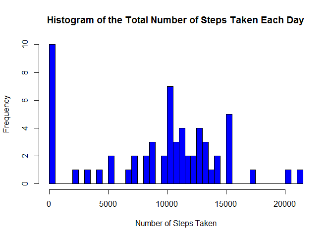
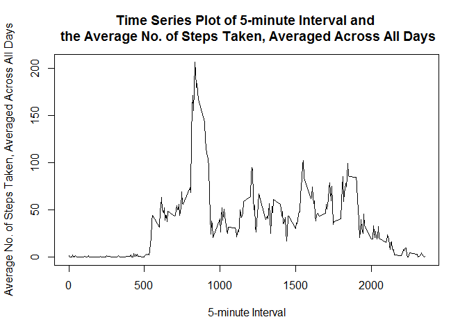
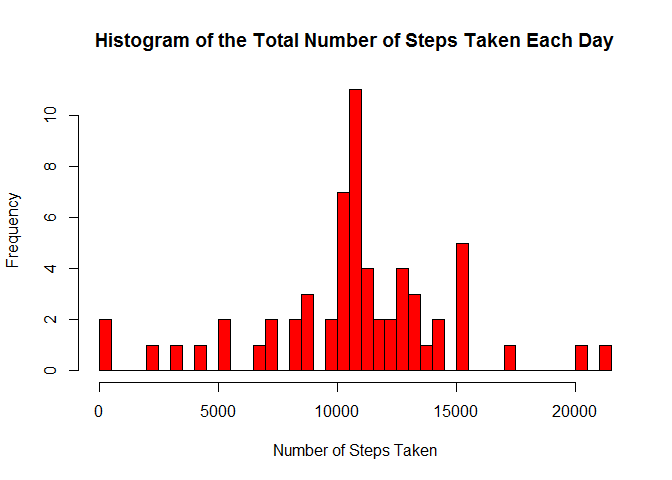

# Reproducible Research: Peer Assessment 1


- Presetting


```r
echo = TRUE  
```

## Loading and preprocessing the data

-  Load the data 


```r
unzip("activity.zip")
data <- read.csv("activity.csv")
```

- Process/transform the data (if nec) into a format suitable for analysis - ie. convert the date to desired format


```r
data$date <- as.Date(data$date,format="%Y-%m-%d")
```

## What is mean total number of steps taken per day?

Ignore the missing values in the dataset:

-  Make a histogram of the total number of steps taken each day


```r
total_steps <- aggregate(data$steps,list(data$date),FUN=sum, na.rm=T)

colnames(total_steps) <- c("date","steps")

hist(total_steps$steps,
           col="blue", breaks = 61,
           xlab="Number of Steps Taken",
           main="Histogram of the Total Number of Steps Taken Each Day")
```

 

-  Calculate and report the mean and median 


```r
mean <- mean(aggregate(data$steps,list(data$date),FUN=sum, na.rm=T)$x)
mean
```

```
## [1] 9354.23
```

```r
median <- median(aggregate(data$steps,list(data$date),FUN=sum, na.rm=T)$x)
median
```

```
## [1] 10395
```

## What is the average daily activity pattern?

-  Make a time series plot (i.e. type="1" ) of the 5-minute interval (x-axis) and the average number of steps taken, averaged across all days (y-axis)


```r
ave_steps <- aggregate(data$steps,list(data$interval),FUN=mean, na.rm=T)

colnames(ave_steps) <- c("interval","steps")

plot(ave_steps$interval,
             ave_steps$steps,
             type="l",
             col="black",
             xlab="5-minute Interval",
             ylab="Average No. of Steps Taken, Averaged Across All Days",
             main="Time Series Plot of 5-minute Interval and \n the Average No. of Steps Taken, Averaged Across All Days")
```

 

-  Which 5-minute interval, on average across all the days in the dataset, contains the maximum number of steps?


```r
ave_steps[ave_steps$steps == max(ave_steps$steps), ]
```

```
##     interval    steps
## 104      835 206.1698
```

## Imputing missing values

-  Calculate and report the total number of missing values in the dataset (i.e. the total number of rows with NAs)


```r
sum(is.na(data))
```

```
## [1] 2304
```

-  Devise a strategy for filling in all of the missing values in the dataset.  The strategy does not need to be sophisticated. For example, you could use the mean/median for that day, or the mean for that 5-minute interval, etc.

    My strategy is to use the mean for that 5-minute interval to fill in each of the         missing values.

    First, I would create a new dataset, new_data, from the original dataset, data, 
    and fill in the missing values using the mean for that 5-minute interval.

    Thereafter, I would check to ensure all missing values are filled up by :
    1. calling the original dataset for comparing to the updated dataset, data1; and           then
    2. running another calculation of the total number of missing values in the updated dataset, data1 to see there are no more missing values.
    
-  Create a new dataset that is equal to the original dataset but with the missing data filled in.


```r
new_data <- data 
for (i in 1:nrow(new_data)) {
    if (is.na(new_data$steps[i])) {
        new_data$steps[i] <- ave_steps[which(new_data$interval[i] == ave_steps$interval), ]$steps
    }
}

head(new_data)
```

```
##       steps       date interval
## 1 1.7169811 2012-10-01        0
## 2 0.3396226 2012-10-01        5
## 3 0.1320755 2012-10-01       10
## 4 0.1509434 2012-10-01       15
## 5 0.0754717 2012-10-01       20
## 6 2.0943396 2012-10-01       25
```


```r
head(data)
```

```
##   steps       date interval
## 1    NA 2012-10-01        0
## 2    NA 2012-10-01        5
## 3    NA 2012-10-01       10
## 4    NA 2012-10-01       15
## 5    NA 2012-10-01       20
## 6    NA 2012-10-01       25
```

```r
sum(is.na(new_data))
```

```
## [1] 0
```

-  Make a histogram of the total number of steps taken each day. Calculate and report the mean and median total number of steps taken per day. Do these values differ from the estimates from the first part of the assignment? What is the impact of imputing missing data on the estimates of the total daily number of steps?


```r
new_total_steps <- aggregate(new_data$steps,list(new_data$date),FUN=sum)

colnames(new_total_steps) <- c("date","steps")

hist(new_total_steps$steps,
           col="red", breaks = 61,
           xlab="Number of Steps Taken",
           main="Histogram of the Total Number of Steps Taken Each Day")
```

 


```r
new_mean <- mean(aggregate(new_data$steps,list(new_data$date),FUN=sum)$x)
new_mean
```

```
## [1] 10766.19
```

```r
new_median <- median(aggregate(new_data$steps,list(new_data$date),FUN=sum)$x)
new_median
```

```
## [1] 10766.19
```


```r
mean_diff <- new_mean - mean
mean_diff
```

```
## [1] 1411.959
```

```r
median_diff <- new_median - median
median_diff
```

```
## [1] 371.1887
```

Both the mean and median increased as new data values and data points are added.  

## Are there differences in activity patterns between weekdays and weekends?

-  Use the dataset with the filled-in missing values to create a new factor variable in the dataset with two levels - "weekday" and "weekend" indicating whether a given date is a weekday or weekend day.


```r
head(new_data)
```

```
##       steps       date interval
## 1 1.7169811 2012-10-01        0
## 2 0.3396226 2012-10-01        5
## 3 0.1320755 2012-10-01       10
## 4 0.1509434 2012-10-01       15
## 5 0.0754717 2012-10-01       20
## 6 2.0943396 2012-10-01       25
```


```r
new_data$weekdays <- factor(format(new_data$date, "%A"))
levels(new_data$weekdays)
```

```
## [1] "Friday"    "Monday"    "Saturday"  "Sunday"    "Thursday"  "Tuesday"  
## [7] "Wednesday"
```


```r
levels(new_data$weekdays) <- list(weekday = c("Monday", "Tuesday",
                                             "Wednesday", 
                                             "Thursday", "Friday"),
                                 weekend = c("Saturday", "Sunday"))
levels(new_data$weekdays)
```

```
## [1] "weekday" "weekend"
```


```r
table(new_data$weekdays)
```

```
## 
## weekday weekend 
##   12960    4608
```

-  Make a panel plot containing a time series plot (i.e. type = "l") of the 5-minute interval (x-axis) and the average number of steps taken, averaged across all weekday days or weekend days (y-axis).


```r
new_ave_steps <- aggregate(new_data$steps, 
                      list(interval = as.numeric(as.character(new_data$interval)), 
                           weekdays = new_data$weekdays),
                      FUN = "mean")

names(new_ave_steps)[3] <- "mean_steps"

library(lattice)
xyplot(new_ave_steps$mean_steps ~ new_ave_steps$interval | new_ave_steps$weekdays, 
       layout = c(1, 2), type = "l", 
       xlab = "Interval", ylab = "Number of steps")
```

 

